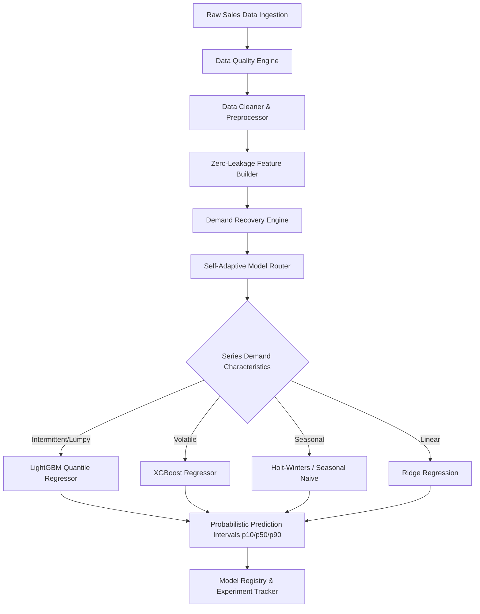

# RetailMind-X System Architecture

## Overview
RetailMind-X is designed with a layered micro-architectural design pattern separating concerns cleanly across ingestion, quality assessment, feature engineering, statistical demand recovery, forecasting models, uncertainty estimation, model routing, and registry storage.

## Layer Breakdown

1. **Data Layer (`src/data/`)**:
   - Downloads and validates raw transactional data.
   - Executes Pydantic contract checks.
   - Assesses dataset completeness, duplicates, zero-spells, and outlier stats.

2. **Preprocessing Layer (`src/preprocessing/`)**:
   - Parses multi-format datetimes.
   - Cleans numeric columns and derives Unit Price.
   - Sorts chronologically per time-series key.

3. **Feature Engineering Layer (`src/features/`)**:
   - Computes calendar, cyclical sin/cos encodings, lags, rolling statistics, and demand volatility.
   - Enforces `.shift(1)` to eliminate lookahead data leakage.

4. **Demand Recovery Layer (`src/demand/`)**:
   - Identifies stockout periods (sales = 0 after high demand).
   - Reconstructs unconstrained demand using Tobit statistical un-censoring.

5. **Forecasting Engine (`src/forecasting/`)**:
   - Houses Baselines, ML Models, Time-Series Models, and PyTorch Deep Learning models.
   - Features the Adaptive Model Router and Probabilistic Quantile Engine.

6. **Validation & Registry (`src/forecasting/registry.py`, `validation.py`)**:
   - Enforces strict chronological train/val/test split.
   - Registers models with full experiment metadata and artifacts.
