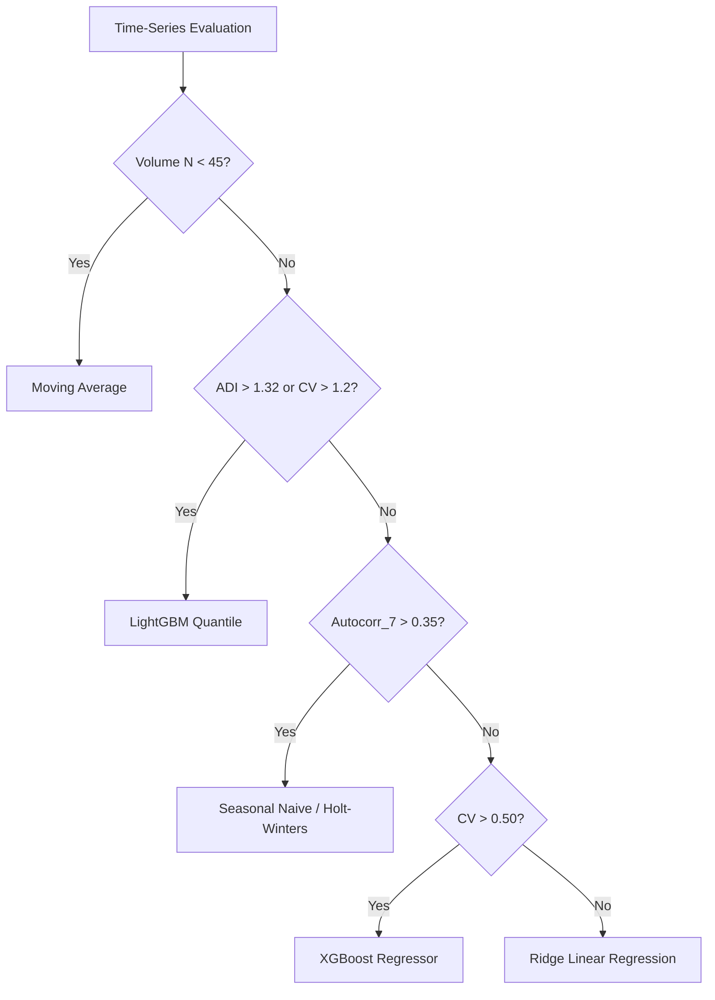

# Adaptive Model Router Methodology

## Purpose
The Adaptive Model Router dynamically analyzes the statistical properties of each time-series and routes it to the most defensible forecasting model rather than applying a single global architecture across all products.

## Diagnostic Metrics Computed
1. **Average Demand Interval (ADI)**: $\text{ADI} = \frac{N_{\text{total}}}{N_{\text{non-zero}}}$. Measures demand intermittency.
2. **Coefficient of Variation (CV)**: $\text{CV} = \frac{\sigma}{\mu}$. Measures demand volatility.
3. **Weekly Autocorrelation ($r_7$)**: Autocorrelation at lag 7. Measures 7-day seasonality.
4. **Data Volume ($N$)**: Total days of historical observations available.

## Routing Decision Rules

## Rationale & Justification
- **Intermittent/Lumpy Demand (ADI > 1.32)**: Tree-based gradient boosting (LightGBM) naturally handles sparse zero-inflated target distributions without bias.
- **Volatile High-Variance Series (CV > 0.50)**: Non-linear decision trees (XGBoost/LightGBM) capture complex feature interactions between price discounts and calendar effects.
- **Strong Seasonal Series ($r_7 > 0.35$)**: Seasonal Naive explicitly preserves 7-day cyclic patterns.
- **Smooth Continuous Series**: Linear models provide stable, low-variance forecasts.
